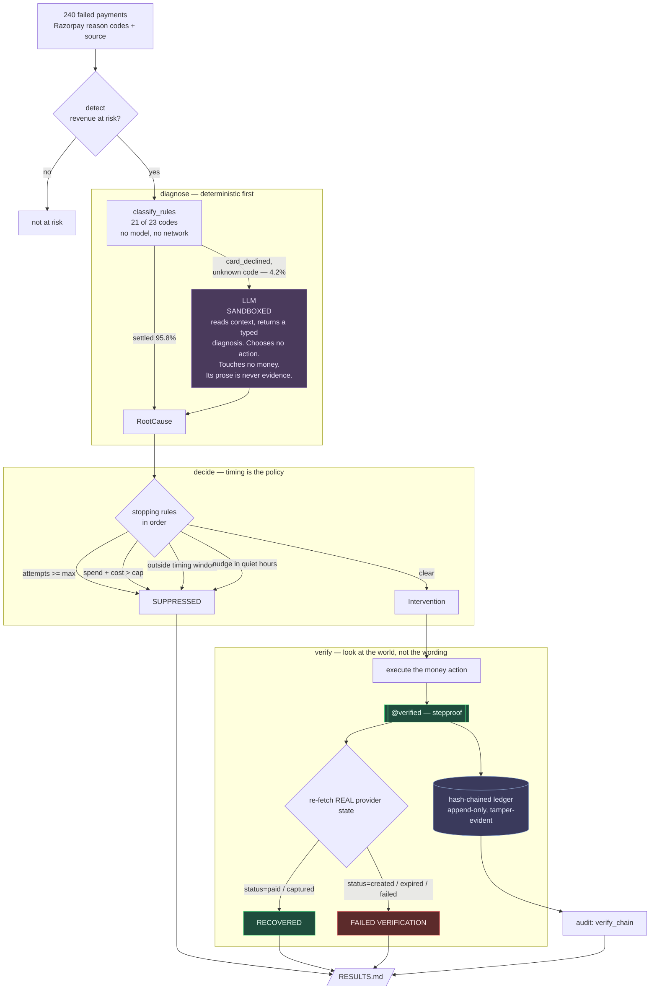
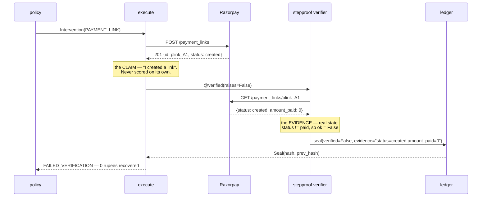

# salvage

**An AI revenue-recovery agent that structurally cannot claim a recovery that did not happen.**

Razorpay AI Buildathon — Track 03, AI Revenue Recovery.

Every money action is verified against real system state after it runs, and sealed into a
hash-chained ledger. A rupee enters the recovered column only when a verifier has *looked
at the provider and seen the money*. Not when the API returned `201`. Not when the tool
reported success. Not when the model said so.

That distinction is not decoration. On the batch below it is worth **₹43,996** — money an
agent trusting its own success claim would have booked and never received.

---

## Run it

```bash
pip install -e . && python -m salvage demo
```

No credentials. No network. No API keys. Generates the batch, runs the full recovery loop
against recorded fixtures and recorded model verdicts, and writes [`RESULTS.md`](RESULTS.md).
Takes about a minute.

```bash
python -m pytest tests/ -q
```

430 tests. The suite is proven to make zero network calls.

---

## What it does

One loop, end to end: **payment failure → root cause → bounded recovery action → verified
outcome.**

- **240 synthetic failed payments** built from Razorpay's own 23 documented failure
  `reason` codes and their `source` field. 80/20 train/holdout, deterministic at seed 7.
- **Root cause** settled by a lookup table for 21 of 23 codes. A model is reached only for
  the genuinely ambiguous tail.
- **Intervention** chosen by timing, not repetition — retrying an `insufficient_funds`
  decline at hour 1 is worse than not retrying at all.
- **Execution** gated by [stepproof](https://github.com/rushikeshgoud19/stepproof), an
  independent verification library this project consumes and never edits.
- **Every action sealed** into a tamper-evident hash chain that reports exactly where it
  breaks if anyone edits it.

---

## Results

Holdout split, n=48, seed 7, offline fixtures. Full report: [`RESULTS.md`](RESULTS.md).

| Measure | Value |
|---|---|
| Value at risk | ₹111,313.68 |
| **Value recovered, seal-verified** | **₹59,031.02** |
| **Recovery rate by value** | **53.0%** |
| Intervention precision | 42.6% |
| False positives (would have self-healed anyway) | 5, costing ₹0.25 |
| Suppressed by a stopping rule | 1 |
| Unresolved | 4 |
| **Failed verification** | **23 records** |
| **Verification gap** | **₹43,996.41** |
| Root-cause accuracy | 100.0% (48/48) |
| Hash chain | **INTACT**, 230 seals, 0 unchecked |

**Read 53.0% as the centre of a band, not a point.** The holdout is 48 records and the
recovery rate moves about ±11 percentage points (1 sd) as the batch is resampled across
seeds. A single quoted percentage from a sample this size would be overclaiming. Published
benchmarks put reason-specific smart retries at 50–65% and generic daily retries at 20–30%,
so 53% is where a competent policy should land — a submission reporting 95% would be
telling you something else.

### The number that matters

**₹43,996.41 across 23 records failed verification.** Each of those actions returned success
from the provider API. A naive agent books all of them. salvage seals them `verified=False`,
routes them to the exception list, and keeps their rupees out of the recovered column.

Breaking those down by what was actually observed, across the full 240-record batch:

| Observed provider state | Records | Value | Verdict |
|---|---|---|---|
| `status=expired amount_paid=0` | 50 | ₹131,994.20 | link issued, never paid — a correct failure |
| `status=failed` | 45 | ₹128,357.44 | retry genuinely declined again — a correct failure |
| `status=created amount_paid=0` | 13 | ₹63,735.56 | **link created, `201` returned, money never arrived** |

That last row is the engineered failure. A payment link is created, the API returns a
well-formed `201` with a real link id, and the link never reaches `paid`. Every layer above
it reports success honestly. Only looking at the provider afterwards catches it.

**This is not a synthetic shape.** Creating a real Razorpay test-mode payment link and
refetching it returns exactly `status=created, amount_paid=0` — verified against live test
traffic during development.

---

## Architecture



### The gate, precisely



---

## Why the model is only on 4.2% of the batch

The track's first judging criterion is **AI judgment**: forcing an LLM into a problem a rule
solves better is explicitly marked down. So the model is sandboxed and stripped of execution
authority. It reads unstructured context and returns a **typed diagnostic proposal**. It
never selects an action, never touches money, and its prose is never used as evidence —
stepproof's narration guard would reject it anyway.

21 of Razorpay's 23 documented reasons invert to a cause deterministically. The model is
reached only for `card_declined` — which names no cause at all — and unrecognised codes.

**And it earns its place there, measurably.** On the 7 records in the full batch the rules
cannot settle:

| | correct |
|---|---|
| rules alone | 0 / 7 |
| with the model | **6 / 7** |

Holdout root-cause accuracy: **95.8% → 100.0%**. The single miss is a `risk_blocked` that is
genuinely indistinguishable from the fields available — a human reading the same row could
not call it either.

Getting there required giving the model a real domain fact. Asked cold, it answered
`auth_failed` at 0.95 confidence and scored **0/7** — confidently wrong is worse than
abstaining. Told the actual base rate (a bare issuer `card_declined` in Indian card payments
most often masks insufficient funds; a failed OTP reports itself explicitly), it scored 6/7.

Model verdicts are recorded to `fixtures/llm_verdicts.json` and replayed. The batch is
deterministic, so one recorded run makes every later run free, offline, and identical —
including yours, with no key at all.

---

## Recovery policy

Timing, not repetition, is what separates a smart retry from a loop.

| Root cause | Action | Why |
|---|---|---|
| `bank_down` | RETRY, short backoff | downtime is transient |
| `insufficient_funds` | hold 72h, then day 3 and day 7 | retrying at hour 1 is worse than not retrying; the hold shortens on the 1st and 15th, when salaries land |
| `auth_failed` | PAYMENT_LINK | a silent retry cannot fix a failed OTP |
| `card_expired`, `mandate_expired` | PAYMENT_LINK | the instrument is dead; no retry revives it |
| `checkout_dropoff` | NUDGE inside 24h, then link | recovery decays sharply after 72h, near-dead at 14 days |
| `risk_blocked` | **ESCALATE to a human, never auto-retry** | compliance, not optimisation |

Four stopping rules, checked in order: attempt cap → cost cap → timing window → quiet hours.
Every suppression names the rule that produced it.

---

## What broke, and how it was recovered

The track asks for this explicitly. All of it is real and none of it is tidied.

**Two builders stalled and produced nothing.** The first parallel run put six tasks on each
of two agents; both hit a 600-second watchdog while still reading, and were killed with zero
files written. The fix was structural: four smaller agents on four git worktrees, each with a
narrowed reading list and the dependency facts inlined rather than left to be discovered.
The second run landed all four lanes.

**Three defects existed only at the seams.** Every lane passed its own tests. All three
failures appeared only when the lanes were composed:

1. `Store` exposed only a private `_path`, so every NUDGE and ESCALATE verifier raised
   `AttributeError` and was swallowed into `UNRESOLVED`. The run printed **"0 isolated
   failures"** while 20 records had failed. That is this project's own thesis biting the
   project — an action reporting a clean outcome while the effect never happened.
2. RETRY verification gated on `amount >= amount_paise`, but `fetch_payment` takes an id and
   nothing else, so offline it can only echo a fixture amount. **78 genuinely captured
   retries failed for a reason unrelated to whether money arrived.** This one was a contract
   defect, not a coding error: the spec demanded a check the interface could not satisfy.
3. The engineered failure cohort surfaced only 4 records — too thin to demonstrate anything.

Fixing them moved holdout recovery from 41.4% to 53.0%.

**A builder argued with the contract and won.** The spec said a verified seal maps to
`RECOVERED`. The builder refused for NUDGE and ESCALATE: their verifier proves *the outreach
was recorded*, not *that money arrived*. Counting those would push the rupees into the
recovered column and rebuild the fake-revenue bug one layer up. The contract was corrected.

**The test suite was quietly making paid API calls.** Two tests asserted "no key → no model
call" and passed for the right reason until a `.env` loader was added — after which they
silently hit the real API on every run. Now pinned, and the suite is asserted network-free.

**Live Razorpay rejected our data.** `"Recurring digits in customer contact are disallowed"`,
HTTP 400 — undocumented until you hit it. One generated phone number in 240 tripped it, which
would have been one dead record and a miserable debug. The generator now resamples.

Full detail: [`.agents/QA-REPORT.md`](.agents/QA-REPORT.md), plus per-lane `BLOCKERS-*.md`
and `REFLECTION-*.md`.

---

## Honest limits

- **The demo runs offline against recorded fixtures.** Razorpay test-mode credentials were
  used during development to validate the request and response shapes against live traffic;
  `salvage run --record` refreshes the fixtures from real test-mode calls. No live-mode
  transaction was ever made, and no real money moved.
- **The batch is synthetic**, built from Razorpay's documented failure taxonomy and
  calibrated against published recovery benchmarks. It is not merchant data.
- **n=48 on the holdout** is small. See the band caveat above.
- **The counterfactual label is generated, not observed.** `would_self_heal` is what makes
  false-positive cost measurable at all, but it is a modelling assumption.
- **The model is one call on one record type.** It is not doing the heavy lifting here, and
  the report says so in the numbers rather than in prose.

---

## Repo map

```
salvage/
  types.py       frozen shared vocabulary — money is integer paise, everywhere
  generate.py    240-record synthetic batch from Razorpay's real reason codes
  detect.py      revenue at risk
  classify.py    rules for 21 of 23 codes; sandboxed model for the tail
  policy.py      intervention choice + four stopping rules
  execute.py     the money actions, every one stepproof-gated
  rzp.py         Razorpay over httpx; offline fixtures; the engineered failure
  store.py       SQLite system of record — a settlement row means money arrived
  pipeline.py    the record loop. never raises.
  metrics.py     the scoring — verified seals only
  audit.py       hash-chain integrity
  report.py      RESULTS.md
  cli.py         generate / run / report / demo
.agents/         the plan, the frozen contract, the QA report, what each lane hit
fixtures/        recorded Razorpay responses and recorded model verdicts
```

Built with a frozen contract and four parallel agents on file-disjoint lanes; the plan, the
contract, and the QA grading are all in [`.agents/`](.agents/).

MIT.
