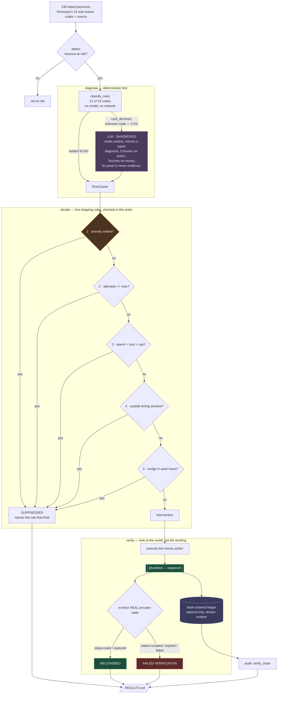
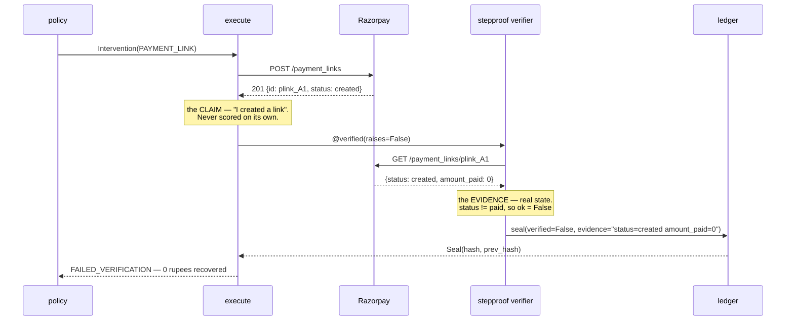

# salvage

[](https://github.com/rushikeshgoud19/salvage/actions/workflows/tests.yml)

**An AI revenue-recovery agent that structurally cannot claim a recovery that did not happen.**

Razorpay AI Buildathon — Track 03, AI Revenue Recovery.



---

## Why this shape

A payments company cannot put an autonomous agent on a money path until the agent's claims
are *checkable*. That is not an engineering preference — it is a reconciliation and
regulatory constraint. An agent that reports "recovered ₹4.2 lakh" and cannot show which
rupees actually settled is not a productivity gain; it is an audit liability with a chat
interface.

So I did not start with the agent. I built the verification layer first —
[**stepproof**](https://github.com/rushikeshgoud19/stepproof), published as its own library
with its own CI before this hackathon existed — and then built a revenue-recovery agent on
top of it to prove the layer does what I claim.

That ordering is the submission. Recovery is the demonstration; **the deployable-agent
problem is the point**, and [it generalises past recovery](docs/PRODUCTION.md#6--where-the-verification-layer-goes-next)
to refunds, payouts, mandates, disputes and KYC — every place an agent asserts a success
nobody checked.

| | |
|---|---|
| **[docs/THREAT-MODEL.md](docs/THREAT-MODEL.md)** | every way this agent can hurt a customer, what stops each one, and the gaps that are still open |
| **[docs/PRODUCTION.md](docs/PRODUCTION.md)** | what would have to change to run it at Razorpay volume, with measured numbers |
| **[docs/LIVE-RUN.md](docs/LIVE-RUN.md)** | a full run against live Razorpay test mode, including the two things that went wrong |
| **[docs/ROBUSTNESS.md](docs/ROBUSTNESS.md)** | the same pipeline across 20 independent batches |
| **[docs/FAQ.md](docs/FAQ.md)** | the hard questions answered directly — synthetic data, only 4.2% LLM, and whether I actually built this |
| **[.agents/](.agents/)** | the frozen contract, the plan, and the QA report that grades where the plan was wrong |

---

## The finding

I ran the identical agent, on the identical batch, scored two ways.

|  | Reports | Rate |
|---|---|---|
| An agent that trusts its tools | ₹103,027.43 | **92.6%** |
| **salvage, seal-verified** | **₹59,031.02** | **53.0%** |
| **Fiction** | **₹43,996.41** | **42.7% of the claim** |

Same records. Same policy. Same actions. Same provider responses. **Only the scoring rule
changes.** The naive agent books 43 recoveries; 20 of them actually happened.

It isn't lying and it isn't badly built. It has no way to find out, because every layer
beneath it honestly reported success. The API returned `201`. The tool relayed `201`. An
output-level judge reads a confident success and agrees.

**That is the entire project.** Not "an agent that recovers revenue" — everyone has one.
An agent whose recovery number is *checkable*.

### And it is not an artefact of the recording

The same pipeline, unmodified, pointed at live Razorpay test mode created five real payment
links, re-fetched each one, and found every one unpaid. **A naive agent would have booked
₹10,807.55 from those `201`s. salvage reported ₹0.00 arrived** — correctly, because nobody
pays a sandbox link. Full transcript, including the two things that went wrong:
[`docs/LIVE-RUN.md`](docs/LIVE-RUN.md).

`status=created, amount_paid=0` — the signature of the engineered failure cohort — turns out
not to be a synthetic shape at all. It is simply what an unpaid Razorpay link looks like.

---

## And it holds across 20 independent batches

One run of 48 records cannot carry a number, so I ran twenty. Full detail:
[`docs/ROBUSTNESS.md`](docs/ROBUSTNESS.md), reproducible with `python -m salvage sweep`.

|  | mean | sd | range |
|---|---|---|---|
| Verified recovery rate | **44.1%** | 12.8pp | 19.8% – 63.7% |
| Naive agent's reported rate | 91.2% | 5.8pp | 75.0% – 98.9% |
| Share of the naive claim that is fiction | **51.7%** | 13.8pp | 28.2% – 78.2% |

**The naive agent overstated in 20 of 20 batches.**

Read that table honestly, because it cuts both ways. The recovery rate is *noisy* — seed 7,
the run shown above at 53.0%, sits above the 44.1% mean. Quoting it alone would be quoting a
favourable draw, which is precisely the cherry-picking this track says it discards. So here
is the distribution instead.

What is **not** noisy is the gap. Every batch, without exception, an unverified agent
overstates. Only the magnitude moves.

---

## Run it

```bash
git clone https://github.com/rushikeshgoud19/salvage && cd salvage
pip install -e . && python -m salvage demo
```

No credentials. No network. No config. Generates the batch, runs the full recovery loop
against recorded Razorpay fixtures and recorded model verdicts, writes
[`RESULTS.md`](RESULTS.md). Seven seconds.

```bash
python -m pytest tests/ -q      # 441 passed — and asserted network-free
python -m salvage sweep         # reproduce the 20-batch table above
```

---

## The loop

Payment failure → root cause → bounded recovery action → **verified** outcome.



### The gate, precisely



Verification is done by [**stepproof**](https://github.com/rushikeshgoud19/stepproof) — a
library I wrote and published *before* this hackathon, and which this project consumes as a
dependency and never edits. The auditor being independent of the thing it audits is not a
detail; it is the reason the number means anything.

### The audit trail is not decorative

Every money action is sealed into an append-only hash chain. Forge one record and the chain
names it:

```
BEFORE  : chain intact (230 records)
forging record 5 (issue_payment_link): verified False -> True
AFTER   : chain_intact=False
          record 5 was modified after sealing: contents hash to
          67385278dfec... but it carries 6ea52666c564...
```

---

## Why the model is on only 4.2% of the batch

The track's first judging criterion is **AI judgment**: forcing an LLM into a problem a rule
solves better is explicitly marked down. So the model is **sandboxed and stripped of
execution authority**. It reads unstructured context and returns a *typed diagnostic
proposal*. It never selects an action, never touches money, and its prose is never used as
evidence — stepproof's narration guard rejects narration outright.

21 of Razorpay's 23 documented reasons invert to a cause deterministically. The model is
reached only for `card_declined` — which names no cause at all — and unrecognised codes.

**It earns those 4.2%, measurably.** On the 7 records in the batch the rules cannot settle:

|  | correct |
|---|---|
| rules alone | 0 / 7 |
| with the model | **6 / 7** |

Holdout root-cause accuracy: **95.8% → 100.0%**. The single miss is a `risk_blocked` that is
genuinely indistinguishable from the fields available.

Getting there needed one real domain fact. Asked cold, the model answered `auth_failed` at
**0.95 confidence** and scored **0/7** — confidently wrong is worse than abstaining. Told the
actual base rate (a bare issuer `card_declined` in Indian card payments usually masks
insufficient funds; a failed OTP reports itself explicitly), it scored 6/7.

Verdicts are recorded to `fixtures/llm_verdicts.json` and replayed, so your clone reproduces
them with no key and no network.

---

## Recovery policy

Timing, not repetition, is what separates a smart retry from a loop.

| Root cause | Action | Why |
|---|---|---|
| `bank_down` | RETRY, short backoff | downtime is transient |
| `insufficient_funds` | hold 72h, then day 3 and day 7 | retrying at hour 1 is worse than not retrying; the hold shortens on the 1st and 15th, when salaries land |
| `auth_failed` | PAYMENT_LINK | a silent retry cannot fix a failed OTP |
| `card_expired`, `mandate_expired` | PAYMENT_LINK | the instrument is dead; no retry revives it |
| `checkout_dropoff` | NUDGE inside 24h, then link | recovery decays sharply after 72h, near-dead at 14 days |
| `risk_blocked` | **ESCALATE to a human, never auto-retry** | compliance, not optimisation |

Four stopping rules, checked in order: attempt cap → cost cap → timing window → quiet hours.
Every suppression names the rule that produced it.

---

## What broke, and how it was recovered

The track asks for this. None of it is tidied.

**Two builders stalled and produced nothing.** The first parallel run gave six tasks each to
two agents; both hit a 600-second watchdog while still reading, and died with zero files
written. Fixed structurally: four smaller agents on four git worktrees, narrowed reading
lists, dependency facts inlined rather than left to be discovered. The second run landed all
four lanes with zero merge conflicts.

**Three defects existed only at the seams.** Every lane passed its own tests. All three
appeared only in composition:

1. `Store` exposed only a private `_path`, so every NUDGE and ESCALATE verifier raised
   `AttributeError` and was swallowed into `UNRESOLVED`. The run printed **"0 isolated
   failures"** while 20 records had failed. *This project's own thesis, biting the project.*
2. RETRY verification gated on an amount the interface cannot supply offline — **78
   genuinely captured retries failed** for a reason unrelated to whether money arrived. A
   contract defect, not a coding error: the spec demanded a check the signature could not satisfy.
3. The engineered failure cohort surfaced only 4 records — too thin to demonstrate anything.

Fixing them moved holdout recovery from 41.4% to 53.0%.

**A builder argued with the contract and won.** The spec said a verified seal maps to
`RECOVERED`. The builder refused for NUDGE and ESCALATE: their verifier proves *the outreach
was recorded*, not *that money arrived*. Counting those would rebuild the fake-revenue bug
one layer up. The contract was corrected, and it is annotated with why.

**The test suite was quietly making paid API calls.** Two tests asserted "no key → no model
call" and passed for the right reason until a `.env` loader was added — after which they hit
the real API on every run. Now pinned, and the suite is asserted network-free by patching
`httpx` to raise.

**The agent could charge a customer twice.** Rerun the batch — a replay, a crash recovery,
a cron that fired twice — and salvage re-presented the instrument for payments that had
already settled. `detect()` filtered on the record alone; `policy.decide()` checked attempts,
cost, timing and quiet hours; **nothing read the `settlements` table.** The system of record
existed the whole time and no code path consulted it — this project's own thesis landing on
the project for a third time. `already_settled` is now the first stopping rule, ahead of
every budget, and one batch run twice proves it: run 1 fires 52 money rails and verifies 25
recoveries; run 2 suppresses exactly those 25 and re-presents nothing.

**Live Razorpay rejected our data.** `"Recurring digits in customer contact are disallowed"`,
HTTP 400 — undocumented until you hit it. One generated phone number in 240 tripped it.

**And live Razorpay rate-limited us mid-run.** Five payment links in about four seconds
returned `429 Too many requests` — unplanned, unsimulated, and not something I knew about
before running it. The batch did not stop: that record became one `UNRESOLVED` row carrying
the verbatim provider error, the rest of the slice ran, the ledger stayed intact, and the
run exited cleanly. The `run_one` isolation contract holding on live infrastructure against
a failure nobody wrote a test for is better evidence than the failure I engineered on
purpose. [`docs/LIVE-RUN.md`](docs/LIVE-RUN.md).

Full grading, with every assertion re-verified independently rather than taken from a
builder's report: [`.agents/QA-REPORT.md`](.agents/QA-REPORT.md).

---

## Honest limits

- **The batch is synthetic.** It is built from Razorpay's own 23 documented failure `reason`
  codes and their `source` field, calibrated against published recovery benchmarks — but the
  records are generated, not merchant data.
- **The demo runs against recorded fixtures**, so that a clone reproduces it exactly with no
  credentials. The rails are real: [`docs/LIVE-RUN.md`](docs/LIVE-RUN.md) is a full run
  against live Razorpay test mode, and `salvage run --record` refreshes the fixtures from
  real test-mode traffic. No live-mode transaction was ever made and no real money moved.
- **RETRY cannot be exercised end to end live.** salvage's `payment_id`s are generated for
  the synthetic batch, so `GET /payments/{id}` returns *"The id provided does not exist"*.
  The verifier handles it correctly — no capture confirmed, so no recovery counted — but
  proving RETRY on real rails needs payments that exist in the account.
- **The engineered failure is one I engineered.** Deliberately — the brief asks for it. But
  the same verifier also catches 50 `expired` and 45 `failed` records that arise naturally
  from the batch and were not planted, so it is not a detector for one known trap.
- **n=48 per holdout.** Hence the 20-seed sweep rather than a single quoted number.
- **`would_self_heal` is a modelling assumption.** It is what makes false-positive cost
  measurable at all, and it is generated, not observed.
- **The model does 4.2% of the work.** By design, and argued for above — but if you want an
  LLM at the centre of the loop, this is not that submission.

---

## Repo map

```
salvage/
  types.py       frozen shared vocabulary — money is integer paise, everywhere
  generate.py    240-record synthetic batch from Razorpay's real reason codes
  detect.py      revenue at risk
  classify.py    rules for 21 of 23 codes; sandboxed model for the tail
  policy.py      intervention choice + four stopping rules
  execute.py     the money actions, every one stepproof-gated
  rzp.py         Razorpay over httpx; offline fixtures; the engineered failure
  store.py       SQLite system of record — a settlement row means money arrived
  pipeline.py    the record loop. never raises.
  metrics.py     the scoring — verified seals only
  baseline.py    the same run scored the way everyone else scores it
  audit.py       hash-chain integrity
  report.py      RESULTS.md
  cli.py         generate / run / report / demo / sweep
.agents/         the plan, the frozen contract, the QA grading, what each lane hit
docs/            ROBUSTNESS.md (20-batch sweep) · LIVE-RUN.md (live test-mode transcript)
fixtures/        recorded Razorpay responses and recorded model verdicts
```

## How it was built

Four agents, file-disjoint lanes, a contract frozen before any of them started. Everything is
in [`.agents/`](.agents/) and it is worth opening, because it is the part most repositories
do not show:

- [`CONTRACT.md`](.agents/CONTRACT.md) — the interface frozen before work began, with three
  clauses annotated *"Corrected at integration"* and the reason each was wrong.
- [`QA-REPORT.md`](.agents/QA-REPORT.md) — 19 assertions, each re-verified independently
  rather than taken from a builder's report, plus the three defects that existed only where
  the lanes met.
- `BLOCKERS-*.md` / `REFLECTION-*.md` — what each lane hit, in its own words, including the
  one that overruled me and was right.

The interesting thing in there is not that it worked. It is that the plan was wrong in three
specific places, and the record says so.

MIT.
